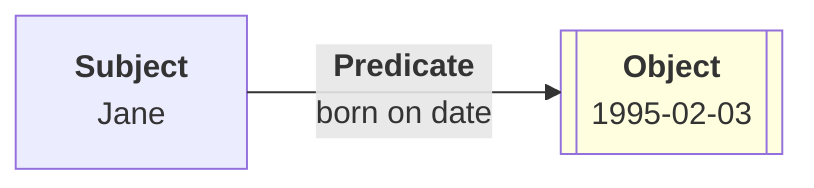
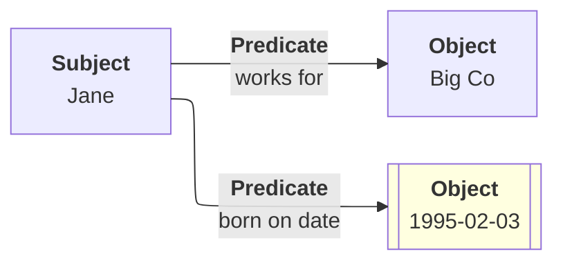
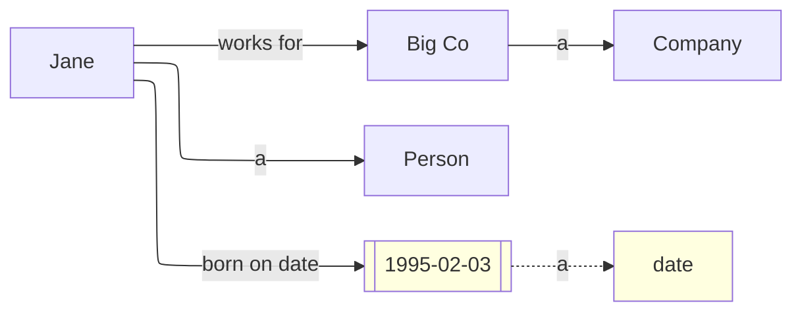
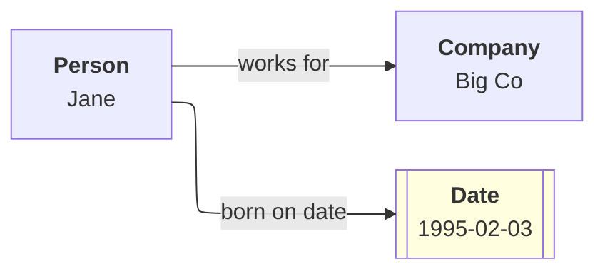
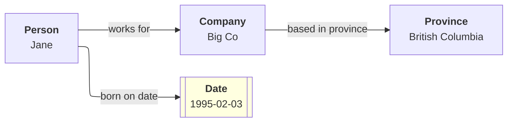

f# What is RDF?

__RDF__, also known as the __Resource Description Framework__ is a way of to describe knowledge graphs in a device and format neutral way.

A __knowledge graph__ is a collection of assertions about various topics, usually given as triples that are broken into the three parts: a subject, a predicate, and an object, as follows:

* A __subject__ is the thing being described,
* A __predicate__ is a relationship that exists on the subject,
* An __object__ is the thing or value that has the predicate as a property on the subject.

For example, the assertion Jane (a person) works for BigCo (a company) can be rendered as:

If the object is a number, date or a string (which are collectively known as __literals__) then the notation is similar, but in general literals don't serve as subjects:

Because both of these statesment have the same subject, they can be combined as a very simple graph:

RDF includes a number of basic modelling conventions, including the notion of a class. In essence, an RDF class describes something that identifies the properties that all members of that class have in common. The `rdf:type` predicate is used to identify classes of subjects and objects, but because this term is so common in RDF, `rdf:type` is frequently replaced with the single letter `a`.

The following shows how such classes are related to specific concepts:

In diagrams such as this, it's customary to put the class above the resource identifier:

Such graphs can be quite extensive, as the object of one assertion may end up being the subject of another assertion. For instance, BigCo may end up being based in British Columbia:

A knowledge graph may have millions of these assertions that collectively describe the state of a given domain of interest.

<i>It's worth noting that the graph itself is purely conceptual - it is a way of describing relationships that are independent of a particular storage technology, and as such, knowledge graphs can be transported from one system to another regardless of the underlying implementations.</i>

[[Home]](README.md)

[[Next]](why-formats.md)
